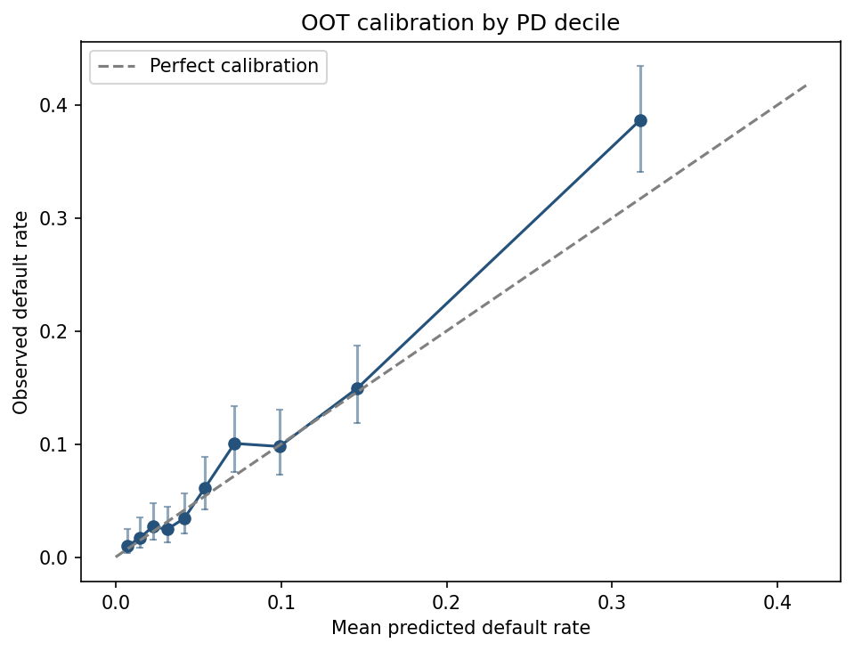

# Mortgage Credit Model Validation

An interview-ready, reproducible independent validation of a synthetic 12-month residential mortgage default model. The project demonstrates the work expected of a model risk analyst: data challenge, conceptual-soundness review, logistic regression, independent benchmarking, backtesting, sensitivity analysis, drift monitoring, governance findings, and stakeholder communication.

> **Important:** This educational case study uses synthetic data and public job-description context only. It does not represent Federal Home Loan Bank of Chicago data, models, policies, thresholds, risk appetite, or validation conclusions. Every threshold in this repo is illustrative.

## Validation opinion

**Satisfactory with limitations.** The logistic champion ranks mortgage risk well, but the synthetic adverse-period evidence identifies calibration and stability weaknesses that require recalibration and monitoring.

| OOT result | Value | Interpretation |
|---|---:|---|
| Loans / defaults | 4,085 / 371 | Sufficient events for headline testing |
| AUC (95% bootstrap CI) | 0.805 (0.781–0.826) | Strong discrimination |
| Gini / KS | 0.609 / 0.456 | Rank ordering passes illustrative criteria |
| Observed / predicted default rate | 9.08% / 8.05% | Model understates absolute risk |
| O/E ratio | 1.128 | Within the 0.80–1.20 range |
| Calibration intercept / slope | 0.345 / 1.096 | Intercept fails the ±0.20 criterion |
| Brier skill vs. prevalence benchmark | 16.4% | Better probabilistic accuracy than the null |
| Score PSI | 0.338 | Material synthetic population shift |
| Acceptance criteria | 13 of 16 pass | Failures: CAL-03, DRF-01, DRF-02 |

The distinction matters: the model can still separate higher- from lower-risk loans while understating the absolute level of default risk when the environment changes.



## What is being validated

- **Target:** `default_12m`, a synthetic indicator for 90+ days past due, foreclosure, or charge-off within 12 months of origination.
- **Champion:** L2-regularized logistic regression with training-only imputation, scaling, and one-hot encoding.
- **Challenger:** fixed shallow decision tree using the same features and temporal partitions.
- **Population:** 20,000 fully synthetic mortgage-like loans, geographically weighted toward Illinois and Wisconsin for case-study relevance.
- **Temporal design:** 2018–2020 train, 2021 validation, 2022 out-of-time test. All preprocessing is fit on training data only.
- **Adverse story:** 2022 includes a stylized shift in borrower mix, rates, unemployment, and house-price conditions. Loan outcomes are observable through the fixed data-as-of date of December 31, 2023. The shift magnitude demonstrates control detection; it is not an estimate of any real portfolio.

Protected-class variables are not used. Fair-lending analysis, production deployment, capital estimation, approval cutoffs, causal inference, and policy decisions are outside this lean case study's scope.

## Quick start

Python 3.10+ is required.

```powershell
python -m venv .venv
.\.venv\Scripts\Activate.ps1
python -m pip install -e ".[dev]"
python -m mortgage_validation.pipeline
python -m pytest -q
```

On macOS or Linux, activate with `source .venv/bin/activate`. The single pipeline command regenerates the synthetic data, frozen model artifacts, SQL check results, validation tables, findings, and six charts from seed `20260713`.

Convenience commands are also available:

```bash
make setup
make run
make test
```

Expected local runtime is seconds, not minutes. No database server, notebook, web app, API, cloud account, or external data is required.

## Evidence produced

| Validation question | Evidence |
|---|---|
| Are the keys, target, dates, ranges, and categories valid? | [`dq_results.csv`](artifacts/tables/dq_results.csv), [`data_quality_checks.sql`](sql/data_quality_checks.sql) |
| Does the champion discriminate risk? | [`metrics.csv`](artifacts/tables/metrics.csv), [`01_discrimination.png`](artifacts/charts/01_discrimination.png) |
| Are predicted PDs calibrated? | [`calibration_deciles.csv`](artifacts/tables/calibration_deciles.csv), [`02_calibration.png`](artifacts/charts/02_calibration.png) |
| Does performance hold through time? | [`backtest_quarterly.csv`](artifacts/tables/backtest_quarterly.csv), [`03_backtest.png`](artifacts/charts/03_backtest.png) |
| Do adverse risk-factor shocks behave plausibly? | [`sensitivity.csv`](artifacts/tables/sensitivity.csv), [`05_sensitivity.png`](artifacts/charts/05_sensitivity.png) |
| Is the population stable? | [`psi.csv`](artifacts/tables/psi.csv), [`04_psi.png`](artifacts/charts/04_psi.png) |
| Does a nonlinear benchmark materially improve results? | [`model_comparison.csv`](artifacts/tables/model_comparison.csv), [`06_champion_vs_challenger.png`](artifacts/charts/06_champion_vs_challenger.png) |
| Which criteria failed, and what action follows? | [`acceptance_results.csv`](artifacts/tables/acceptance_results.csv), [`findings.csv`](artifacts/tables/findings.csv) |

The tree challenger is weaker: its AUC is 0.753 versus 0.805 for the champion, and the paired AUC difference is -0.052 (95% CI -0.067 to -0.036). The recommendation is therefore to retain the transparent champion, recalibrate it, and strengthen monitoring—not replace it merely because a challenger exists.

## Repository map

```text
mortgage-credit-model-validation/
├── config/                 # Data dictionary, governance checklist, thresholds
├── data/generated/         # Rebuilt synthetic CSV (git-ignored)
├── docs/                   # Validation memo
├── sql/                    # Embedded SQLite data-quality controls
├── src/mortgage_validation/
│   ├── data.py             # Seeded mortgage DGP
│   ├── modeling.py         # Champion and challenger
│   ├── metrics.py          # KS, calibration, bootstrap, PSI
│   ├── validation.py       # Independent tests and findings logic
│   ├── charts.py           # Decision-useful plots
│   └── pipeline.py         # One-command orchestration
├── artifacts/              # Review-ready tables and charts
└── tests/                  # Determinism, DQ, leakage, metrics, PSI tests
```

## Findings and governance response

1. **Moderate — calibration:** the OOT calibration intercept is 0.345 against an illustrative ±0.20 limit. Recalibrate on recent representative data and demonstrate that O/E, intercept, slope, ECE, Brier skill, and quarterly coverage pass on a later held-out period.
2. **Moderate — drift:** interest rate, unemployment, HPI change, and predicted PD have PSI above 0.25 in the stylized OOT regime. Investigate root causes and monitor quarterly PSI, AUC, and O/E with documented escalation.
3. **Observation — benchmarking:** the constrained tree does not improve AUC or Brier score. Keep the interpretable champion and repeat benchmarking during redevelopment.

Revalidation should be triggered by material methodology or feature changes, data-source changes, target redefinition, PSI above 0.25 with performance impact, sustained calibration misses, or challenger evidence of stable material improvement.

## Interview talking points

- AUC answers “who is riskier?”; calibration answers “how much risk?” A model can pass the first and fail the second.
- Chronological splitting, training-only preprocessing, and a complete outcome window are the central leakage controls.
- PSI is a screening signal, not proof of model failure; it must be connected to calibration and backtesting.
- The validator's job is not to force a challenger to win. Here, transparency plus better OOT performance supports retaining the logistic model with remediation.
- Each finding links a failed criterion to evidence, impact, an owner, a measurable action, and closure evidence.

See the full [`model_validation_memo.md`](docs/model_validation_memo.md) for scope, methodology, results, limitations, and the illustrative validation opinion.
